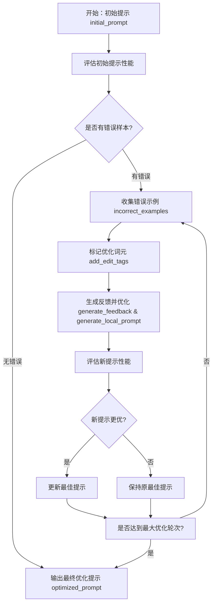

# LPO (Local Prompt Optimization) 本地提示优化器

一个基于本地数据集的AI提示词自动优化工具，通过分析模型错误表现来生成更优的提示词。

## 🎯 项目简介

LPO (Local Prompt Optimization) 是一个智能提示词优化工具，它能够：

- **自动分析**：识别AI模型在特定任务上的错误表现
- **智能标记**：自动标记提示词中需要优化的部分
- **迭代优化**：通过多轮优化生成更有效的提示词
- **效果对比**：直观展示优化前后的性能提升

## ✨ 核心特性

### 🔍 错误驱动优化
- 收集模型预测错误的样本
- 分析错误模式，生成针对性反馈
- 基于错误信息优化提示词

### 🏷️ 智能编辑标记
- 自动识别提示词中需要优化的词元
- 使用 `<edit>` 标签标记优化区域
- 保持提示词结构的完整性

### 📊 性能评估
- 实时评估提示词在数据集上的表现
- 提供详细的准确率对比
- 可视化优化效果

### ⚙️ 高度可配置
- 支持多种AI模型（GPT-4、GPT-3.5等）
- 可调整优化参数（温度、步数、beam size等）
- 统一的配置文件管理

## 🏗️ 项目结构

```
ai_homework/
├── README.md                    # 项目说明文档
├── demo.py                      # 演示脚本
├── lpo_optimizer/              # 核心优化器
│   ├── __init__.py
│   ├── config.py               # 配置文件
│   ├── core/                   # 核心功能模块
│   │   ├── __init__.py
│   │   ├── optimization.py     # 主优化流程
│   │   ├── edit_tagging.py     # 编辑标记功能
│   │   ├── evaluation.py       # 提示评估功能
│   │   └── prompt_proposal.py  # 提示生成功能
│   └── utils/                  # 工具函数
│       ├── __init__.py
│       ├── data_loader.py      # 数据加载
│       └── feedback.py         # 反馈生成
└── data/                       # 数据集
    └── BIG-Bench-Hard/         # BIG-Bench-Hard数据集
        └── bbh/
            ├── boolean_expressions.json
            ├── causal_judgement.json
            ├── date_understanding.json
            └── ...             # 更多任务数据集
```

## 🚀 快速开始

### 1. 环境要求

- Python 3.7+
- OpenAI API 密钥
- 网络连接（用于API调用）

### 2. 安装依赖

```bash
pip install openai
```

### 3. 配置API

编辑 `lpo_optimizer/config.py` 文件：

```python
# OpenAI API配置
OPENAI_API_KEY = "your-api-key-here"  # 替换为你的API密钥
OPTIMIZER_MODEL = "gpt-4o-mini"       # 用于优化的模型
TASK_MODEL = "gpt-4o-mini"            # 用于任务执行的模型

# 实验参数
MAX_OPTIMIZATION_STEPS = 3             # 最大优化轮次
BEAM_SIZE = 4                          # 每轮生成的候选提示数
TEMPERATURE = 0.3                      # 生成温度（控制随机性）
```

### 4. 运行演示

```bash
python demo.py
```

## 📖 使用指南

### 基本使用

```python
from lpo_optimizer.core.optimization import run_lpo
from lpo_optimizer.utils.data_loader import load_bbh_dataset

# 加载数据集
dataset = load_bbh_dataset("data/BIG-Bench-Hard/bbh/boolean_expressions.json")

# 运行优化
initial_prompt = "Let's think step by step."
optimized_prompt = run_lpo(initial_prompt, dataset[:20])

print(f"优化后的提示: {optimized_prompt}")
```

### 自定义数据集

支持多种数据格式：

```python
# BBH格式数据集
dataset = load_bbh_dataset("path/to/bbh_dataset.json")

# 自定义格式
dataset = [
    ("输入问题1", "期望答案1"),
    ("输入问题2", "期望答案2"),
    # ...
]
```

### 配置优化参数

```python
# 在 config.py 中调整参数
MAX_OPTIMIZATION_STEPS = 5    # 增加优化轮次
TEMPERATURE = 0.1             # 降低随机性
BEAM_SIZE = 8                 # 增加候选数量
```

## 🔧 核心模块说明

### optimization.py - 主优化流程

```python
def run_lpo(initial_prompt: str, dataset: List[Tuple[str, str]]) -> str:
    """
    LPO主优化流程
    - 收集错误示例
    - 标记优化词元
    - 生成反馈并优化
    - 评估更新
    """
```

### edit_tagging.py - 编辑标记

```python
def add_edit_tags(prompt: str, incorrect_examples: List[str]) -> str:
    """
    根据错误示例标记提示中需优化的词元
    返回带<edit>标签的提示
    """
```

### evaluation.py - 性能评估

```python
def evaluate_prompt(prompt: str, dataset: List[Tuple[str, str]]) -> float:
    """
    评估提示在数据集上的准确率
    返回0-1之间的准确率
    """
```

## 📊 支持的数据集

项目内置BIG-Bench-Hard数据集，包含25个具有挑战性的推理任务：

- **逻辑推理**：boolean_expressions, logical_deduction
- **数学计算**：multistep_arithmetic_two
- **因果判断**：causal_judgement
- **时间理解**：date_understanding, temporal_sequences
- **空间推理**：geometric_shapes, navigate
- **语言理解**：disambiguation_qa, hyperbaton
- **对象追踪**：tracking_shuffled_objects
- **表格推理**：penguins_in_a_table
- **运动理解**：sports_understanding

## 🎯 应用场景

### 1. 学术研究
- 提示工程研究
- 模型性能优化
- 推理能力评估

### 2. 实际应用
- 客服机器人优化
- 教育问答系统
- 专业领域助手

### 3. 模型调试
- 识别模型弱点
- 改进提示策略
- 性能基准测试

## ⚠️ 注意事项

### API使用
- 确保API密钥有效且有足够配额
- 优化过程会消耗较多API调用
- 建议在测试时使用较小的数据集

### 性能考虑
- 优化时间取决于数据集大小和模型响应速度
- 建议先用小数据集测试效果
- 可以根据需要调整优化参数

### 数据隐私
- 所有优化都在本地进行
- 不会将数据发送到外部优化服务
- 保护敏感数据的隐私


